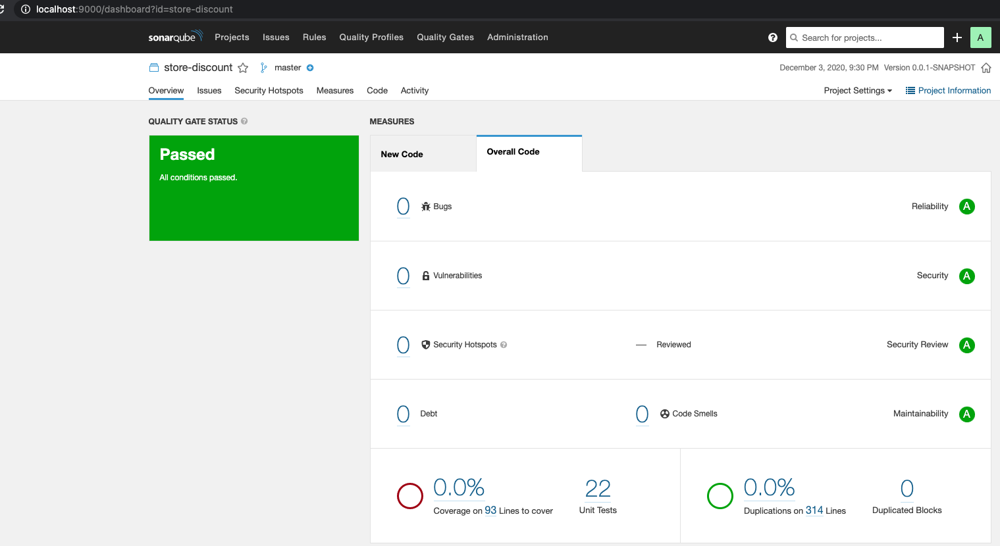
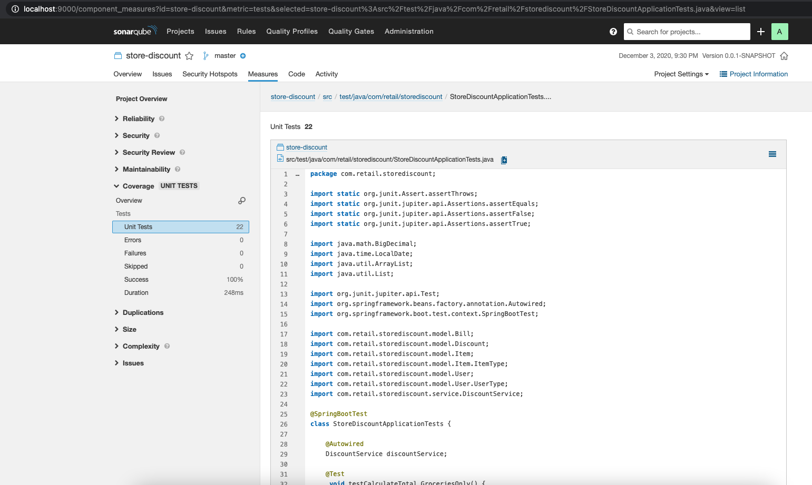

# The Retail Store Discounts


## Installing

```bash
mvn clean install
```

## Starting the server

```bash
mvn spring-boot:run
```


## Executing the unit tests

```bash
mvn test
```

### API Info

* Http Method - **POST**
* Endpoint - **localhost:8080/api/discount**

Example request

```json
{
    "bill": {
        "items": [
            {
                "type": "GROCERY",
                "price": 25
            },
            {
                "type": "OTHER",
                "price": 200
            }
        ]
    },
    "user": {
        "type": "AFFILIATE",
        "joinDate": "2020-03-11"
    }
}

```

Example response.

```json
193.75
```


## Code coverage

The code coverage report:


| Coverage | 94.00% |
|---|---|




### 


